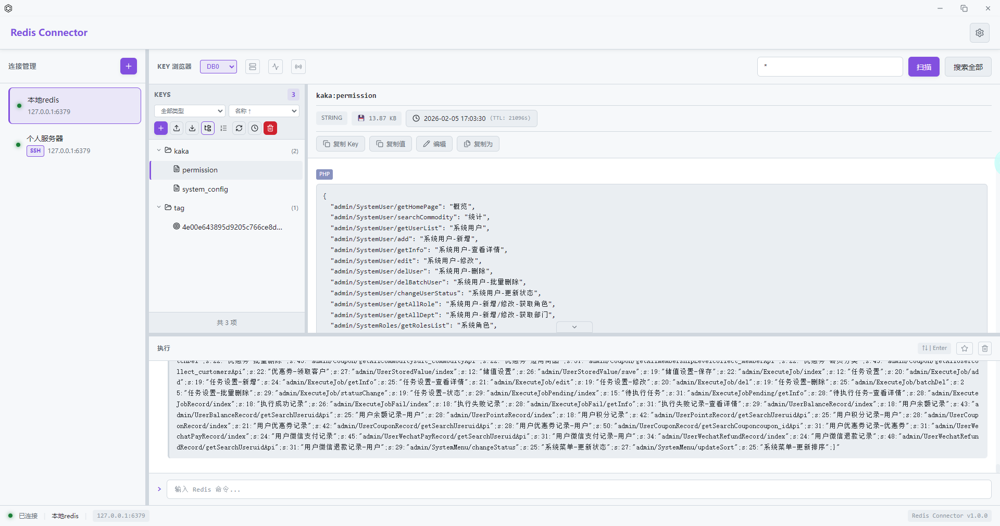

# Redis Connector

自研 RESP 协议的 Redis GUI 客户端

## 是什么

一个基于 Electron + TypeScript + React 构建的 Redis 图形化管理工具，核心特点是**自研 RESP 协议解析层**，而非依赖现有 Redis 客户端库。

## 为什么存在

1. **学习价值**：深入理解 Redis 通信协议（RESP）
2. **轻量可控**：不依赖重型 Redis 客户端库
3. **跨平台**：Windows / macOS / Linux 全平台支持

## 功能特性

- 🔌 **连接管理**：多连接配置、快速切换
- 📝 **命令控制台**：命令执行、历史记录、自动补全
- 🗂️ **Key 浏览器**：可视化浏览、搜索过滤
- 📊 **数据查看**：支持 String/List/Set/ZSet/Hash 类型
- 🎨 **暗色主题**：护眼设计

## 界面预览



## 快速开始

### 环境要求

- Node.js >= 18
- npm >= 8

### 安装依赖

```bash
npm install
```

### 开发模式

```bash
# 仅启动 Web 界面（用于 UI 开发）
npm run dev

# 启动完整 Electron 应用
npm run electron:dev
```

### 构建发布

```bash
npm run electron:build
```

## 项目结构

```
redis-connector/
├── core/                 # 核心协议层
│   ├── types.ts         # 类型定义
│   ├── resp-parser.ts   # RESP 协议解析器
│   ├── resp-serializer.ts # RESP 协议序列化
│   └── redis-client.ts  # Redis 客户端封装
├── electron/            # Electron 主进程
│   ├── main.ts         # 应用入口
│   ├── preload.ts      # 预加载脚本
│   └── ipc/            # IPC 通信处理
├── src/                 # 渲染进程（React）
│   ├── components/     # UI 组件
│   ├── stores/         # 状态管理
│   └── styles/         # 样式文件
└── tests/              # 测试用例
```

## 技术栈

| 层级 | 技术 |
|------|------|
| 协议层 | 自研 RESP 解析器 + Node.js net 模块 |
| 桌面框架 | Electron 28 |
| 前端框架 | React 18 + TypeScript |
| 构建工具 | Vite 5 |
| 打包工具 | electron-builder |

## RESP 协议简介

Redis 使用 RESP (REdis Serialization Protocol) 进行通信：

```
类型标识符：
+ 简单字符串  "+OK\r\n"
- 错误       "-ERR unknown command\r\n"
: 整数       ":1000\r\n"
$ 批量字符串  "$5\r\nhello\r\n"
* 数组       "*2\r\n$3\r\nfoo\r\n$3\r\nbar\r\n"
```

本项目在 `core/resp-parser.ts` 中完整实现了 RESP 协议的解析。

## License

MIT
